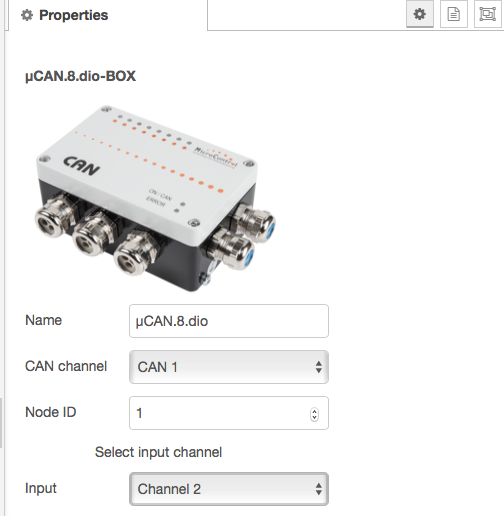

# node-red-contrib-canopen-mcan

> Node-RED Nodes for MicroControl CANopen devices

With these Nodes you can connect [MicroControl CANopen modules](https://www.microcontrol.net/en/products/io-module/) to [Node-RED](https://nodered.org/).

## Requirements

- &micro;MIC.200 controller
- CANopen server daemon (Comet)

## Supported devices

Currently the following CANopen devices are supported by this plugin:

* &micro;CAN.4.ai-BOX
* &micro;CAN.4.ao-BOX
* &micro;CAN.4.ti-BOX
* &micro;CAN.8.dio-BOX
* &micro;CAN.8.pwm-BOX

## How to use

A single node represents either an input or an output of a CANopen device. As such, a node
has only either one input or one output. After dragging a node to the flow you need to
configure the CAN interface, node-ID and channel number.

### Node configuration

A node is defined by the following properties:

* CAN channel - i.e. the used CAN interface on the &micro;MIC.200 controller
* Node ID - i.e. the CANopen device address setting
* Input / Output channel - i.e. the input or output connected for the signal

